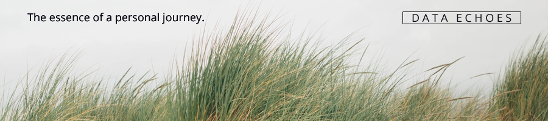

**Data Echoes** is a digital time capsule that captures the essence of **Linn Ruth Friberg**'s personal journey. It contains an online platform hosting a range of puzzles and challenges that were created by her, referred to as **perception:enigma**. This platform offers a challenging and engaging experience for those who enjoy solving puzzles and riddles. The puzzles are designed to push the limits of your brainpower and test your ability to think critically and logically. Each challenge presents a unique scenario that requires careful analysis, observation, and reasoning to arrive at the correct solution. Additionally, the article documenting her creative and personal pursuits, called **The Memory Shell**, provides an in-depth look at her life and creative career.

Data Echoes serves as a permanent central hub that documents her life and activities. As time goes on, you can expect to find more items added to this collection, including a summary of her skills and a photo archive of her local and international travels. Data Echoes is an invaluable tool for those looking to get a complete picture of her life.

The TiddlyWiki-based time capsule can be downloaded [here](https://github.com/linfri/DataEchoes/blob/main/DataEchoes.html). Make sure to download the file via "Save Link As..."
